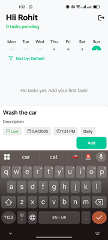
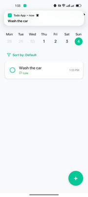
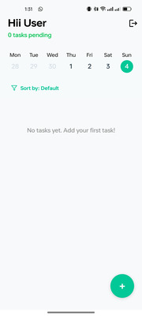

# To-Do App

A cross-platform To-Do List app built using React Native with Expo, designed for Android and iOS. This app lets users manage their daily tasks efficiently and sends notification for tasks deadlines.


## Features

- Create, update, and delete tasks
- Create, update, and delete tasks

- Schedule tasks with due dates and receive notifications

- Works on both Android and iOS

- Clean and intuitive UI using React Native components

- Persistent storage using AsyncStorage or SQLite

- Built using Expo for quick development and testing


## Screenshots








## Tech Stack

- React Native

- Expo SDK

- Firebase

- Expo Notifications

- AsyncStorage or SQLite (for persistent data)

- React Navigation (for navigating between screens)


## Environment Variables

To run this project, you will need to add the following environment variables to your .env file

```bash
API_KEY=your_api_key
AUTH_DOMAIN=your_project.firebaseapp.com
PROJECT_ID=your_project_id
STORAGE_BUCKET=your_project.appspot.com
MESSAGING_SENDER_ID=your_messaging_sender_id
APP_ID=your_app_id
MEASUREMENT_ID=your_measurement_id
```


## Installation

Clone the repository

```bash
  git clone https://github.com/Rohit-00/todo-assignment.git
  cd todo-assignment
```

Install the dependencies

```bash
  npm install
``` 

Start the app

```bash
  npx expo start
```

## Future Scope
- Add a local database (expo sqlite)
- Add google oauth
- Edit feature